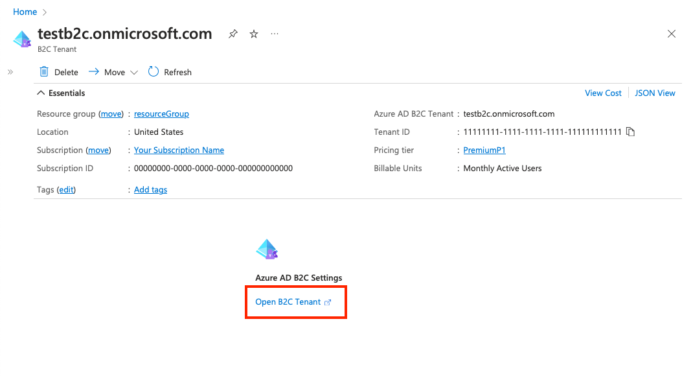
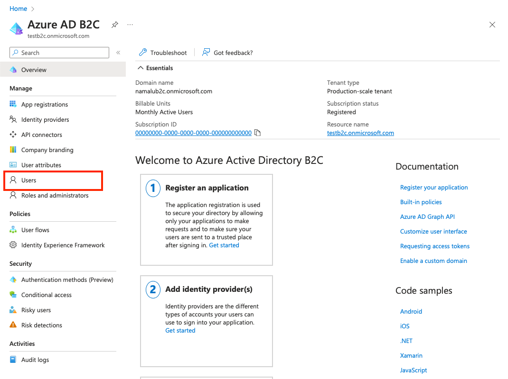
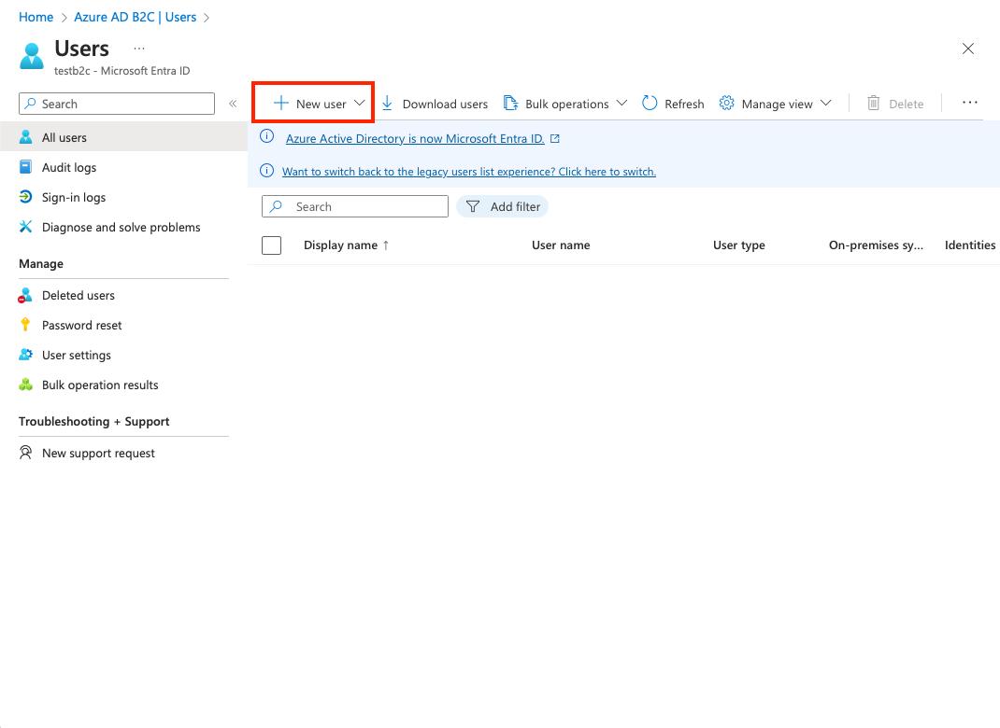
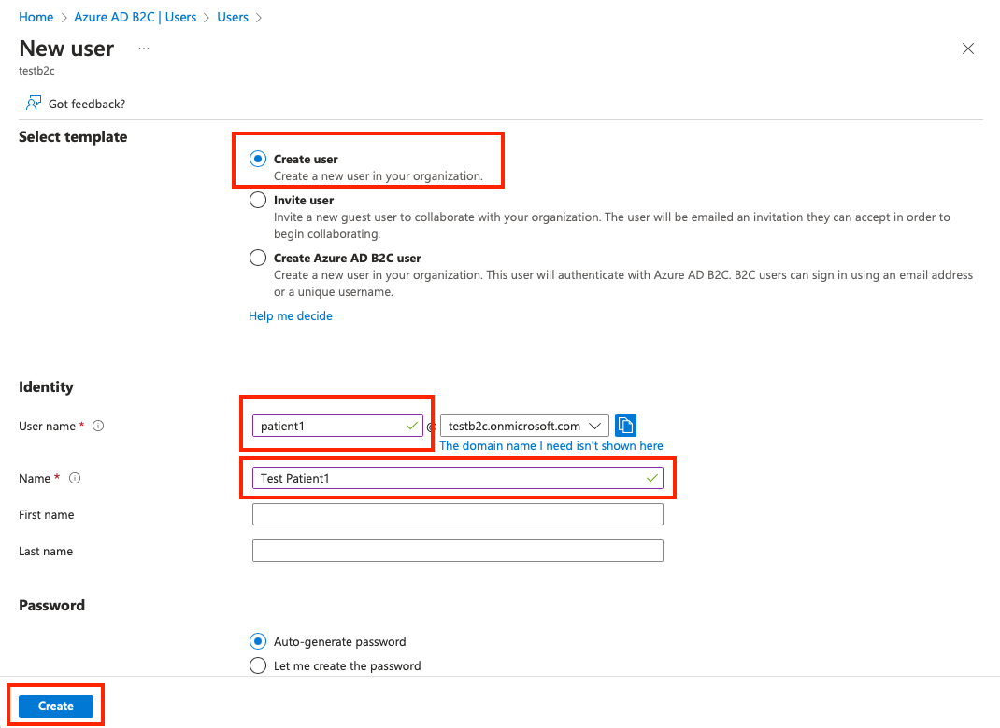
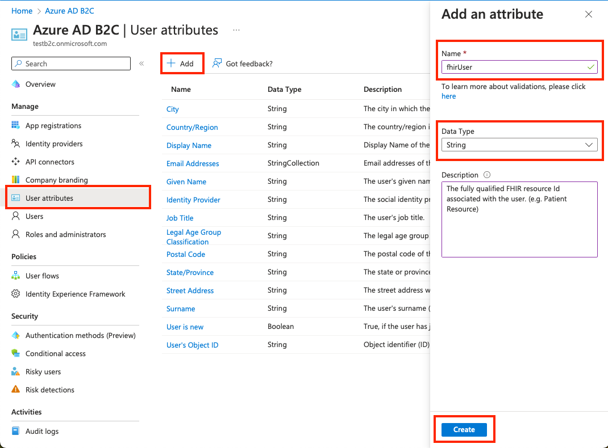
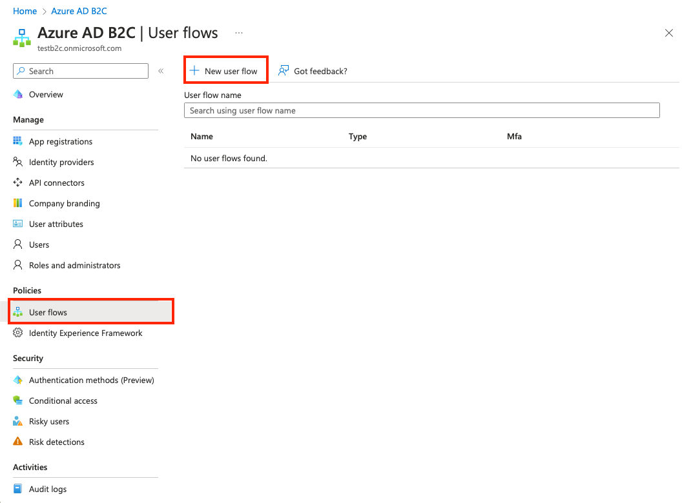
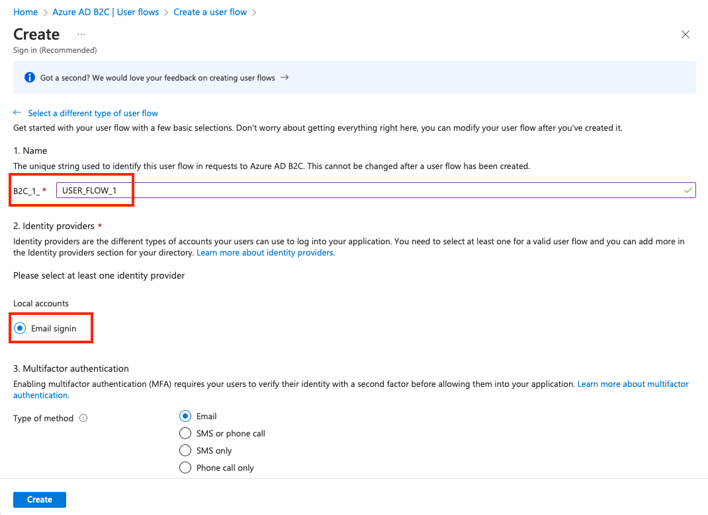
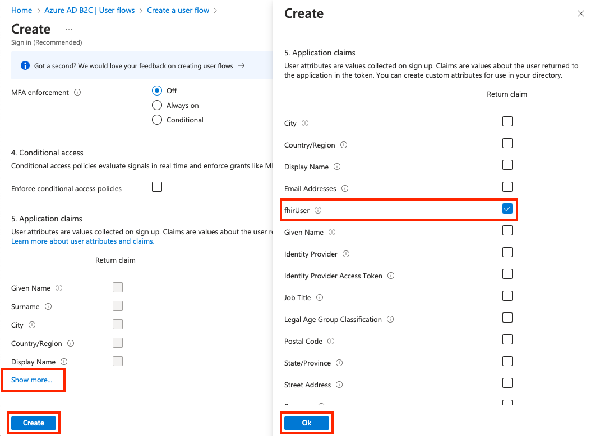

# Create an Azure AD B2C tenant for the FHIR service

Creating an Azure AD B2C tenant for the FHIR service sets up a secure infrastructure for managing user identities in your healthcare applications.

If you already created an Azure AD B2C tenant, you can skip to [Deploy the FHIR service with Azure AD B2C](/deploy-fhir-service.md).

## Overview

This tutorial provides instructions on how to

1. [Deploy an Azure AD B2C tenant by using an ARM template](#deploy-an-azure-ad-b2c-tenant-by-using-an-arm-template)
1. [Add a test B2C user to the Azure AD B2C tenant](#add-a-test-b2c-user-to-the-azure-ad-b2c-tenant)
1. [Link a B2C user with the fhirUser custom user attribute](#link-a-b2c-user-with-the-fhiruser-custom-user-attribute)
1. [Create a new B2C user flow](#create-a-new-b2c-user-flow)
1. [Create a new B2C resource application](#create-a-new-b2c-resource-application)

After completing these 5 steps, your B2C tenant can be used to grant access tokens to access FHIR service resources.

### Deploy an Azure AD B2C tenant by using an ARM template

Use PowerShell or Azure CLI to deploy the [ARM Template](templates/b2c-arm-template.json) programmatically to an Azure subscription. For more information about syntax, properties, and usage of the template, see [Deploy an instance of Azure Active Directory B2C](https://learn.microsoft.com/en-us/azure/templates/microsoft.azureactivedirectory/b2cdirectories?pivots=deployment-language-arm-template).

Run the code in Azure Cloud Shell or in PowerShell locally in Visual Studio Code to deploy the FHIR service to the Azure AD B2C tenant.

### Using Powershell

1. Use `Connect-AzAccount` to sign in to Azure. After you sign in, use `Get-AzContext` to verify the subscription and tenant you want to use. Change the subscription and tenant if needed.

2. Create a new resource group, or use an existing one by skipping the step or commenting out the line starting with `New-AzResourceGroup`.

```Powershell
### variables
$tenantid="your tenant id"
$subscriptionid="your subscription id"
$resourcegroupname="your resource group name"
$b2cName="your b2c tenant name"

### login to azure
Connect-AzAccount -Tenant $tenantid -SubscriptionId $subscriptionid

### create resource group
New-AzResourceGroup -Name $resourcegroupname -Location $region

### deploy the resource
New-AzResourceGroupDeployment -ResourceGroupName $resourcegroupname -TemplateFile "templates/b2c-arm-template.json" -b2cName $b2cName
```

### Using Azure CLI

Use `az login` to sign in to Azure. After you sign in, use `az account show --output table` to verify the subscription and tenant you want to use. Change the subscription and tenant if needed.

Create a new resource group, or use an existing one by skipping the step or commenting out the line starting with `az group create`.

```bash
### variables
tenantid=your tenant id
subscriptionid=your subscription id
resourcegroupname=your resource group name
b2cName=your b2c tenant name

### login to azure
az login
az account show --output table
az account set --subscription $subscriptionid

### create resource group
az group create --name $resourcegroupname --location $region

### deploy the resource
az deployment group create --resource-group $resourcegroupname --template-file 'templates/b2c-arm-template.json' --parameters b2cName=$b2cName
```

### Add a test B2C user to the Azure AD B2C tenant

You need a test B2C user to associate with a specific patient resource in the FHIR service, and to verify that the authentication flow works as expected.

1. In the Azure portal, go to the B2C resource. Choose [Open B2C Tenant](https://learn.microsoft.com/en-us/azure/active-directory-b2c/manage-users-portal).



2. On the left pane, choose "Users".



3. Choose "+ New user".



4. Choose "Create new user".

5. Select the "Create user" template.

6. Give the "User name" and "Name".

7. Select "Auto-generate password" or create one.

8. Choose "Create". 



### Link a B2C user with the fhirUser custom user attribute

The `fhirUser` custom user attribute is used to link a B2C user with a user resource in the FHIR service. In this example, a user named "Test Patient1" is created in the B2C Tenant, and in a later step, a [Patient](https://www.hl7.org/fhir/patient.html) resource is created in the FHIR service. The "Test Patient1" user is linked to the Patient resource by adding setting the `fhirUser` attribute value to the Patient resource identifier. For more information about custom user attributes, see [User flow custom attributes in Azure Active Directory B2C](https://learn.microsoft.com/en-us/azure/active-directory-b2c/user-flow-custom-attributes?pivots=b2c-user-flow).

1. On the "Azure AD B2C" page in the left pane, choose "User attributes".

2. Choose "+ Add".

3. In the Name field, enter "fhirUser" (case-sensitive).

4. From the "Data Type" dropdown list, select "String".

5. Choose "Create".



### Create a new B2C user flow

User flows define the sequence of steps users must follow to sign in. In this example, a user flow is defined so that when a user signs in, the access token provided includes the `fhirUser` claim. For more information, see [Create user flows and custom policies in Azure Active Directory B2C](https://learn.microsoft.com/en-us/azure/active-directory-b2c/tutorial-create-user-flows?pivots=b2c-user-flow).

1. On the "Azure AD B2C page" in the left pane, choose "User flows". 

2. Choose "+ New user flow".



3. Give the user flow a unique name to the B2C tenant(The name doesn't have to be globally unique). In this example, the name of the user flow is "USER_FLOW_1". Make note of the name.

4. Make sure "Email signin" is enabled for Local accounts. This will provide a way for the user created in an earlier step to sign in to obtain an access token to the FHIR service.



5. On the "Create a user flow" page, scroll to section 5. "Application Claims", and then select "Show more..." to show a list of all available claims.

6. Select the fhirUser claim.

7. Choose Ok.

8. Choose Create.



### Create a new B2C resource application

The B2C resource application handles authentication requests from your healthcare application to Azure Active Directory B2C.

1. Run below command to login to the created AZURE AD B2C tenant.

Azure CLI
```bash
az login --tenant "<YOUR_B2C_TENANT_NAME>.onmicrosoft.com" --allow-no-subscriptions
```

Powershell:
```Powershell
Connect-AzAccount -tenant "<YOUR_B2C_TENANT_NAME>.onmicrosoft.com" 
```

2. Run below command to create and configure a B2C resource application.

Windows:
```Powershell
    powershell ./scripts/ConfigureB2C-App.ps1 -APPLICATION_NAME "<Application Name>"
```

 Mac/Linux:
```bash
    pwsh ./scripts/ConfigureB2C-App.ps1 -APPLICATION_NAME "<Application Name>" 
```

A newly created application will be listed on the application registration page and will be configured as described below.
* Add a display name (FHIR Service App in this example).
* Select "Accounts in any identity provider or organizational directory (for authenAppticating users with user flows) from the "Supported account types" options.
* Select "Public client/native (mobile & desktop)" from the list of platforms under the "Redirect URI (recommended)" section. Populate the value with the [Postman](https://www.postman.com) callback URI [https://oauth.pstmn.io/v1/callback](#create-a-new-b2c-resource-application). The callback will be used in a later step when testing using Postman.
* Select "Grant admin consent to openid and offline_access permissions".
* Populate the "oauth2Permissions" array in "Manifest" in the left menu, with the required permissions. It's important to understand that if a permission is added to the list, any user in the B2C tenant can obtain an access token with the API permission. If a level of access in not appropriate for a user within the B2C Tenant, the permission should not be added to the array because there is no way to limit permissions to a subset of users.
* The "Application ID URI" will be populated as `"https://<PRIMARY_DOMAIN>/<APPLICATION_NAME>_fhir"`
* The permission "patient.all.read" will be added to the created resource application. This means that a user that requests an access token with the scope "patient.all.read" will have Read privileges (patient.all.**read**) over all FHIR resources (patient.**all**.read) in the (**patient**.all.read) [Patient compartment](https://build.fhir.org/compartmentdefinition-patient.html).
This can be verified by clicking on "API permissions" in the left menu on the App registrations page.
