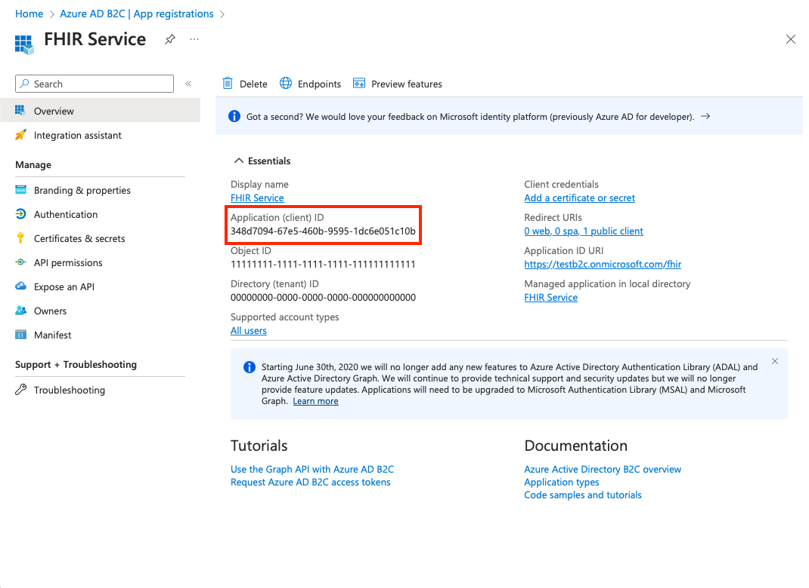

# Deploy FHIR service with Azure Active Directory B2C as the identity provider

Deploying the FHIR service with Azure Active Directory B2C as the identity provider allows the FHIR service to authenticate users based on their Azure AD B2C credentials, ensuring that only authorized users can access sensitive patient information

## Overview

This tutorial provides instructions on how to

1. [Obtain the B2C authority and client id](#obtain-the-b2c-authority-and-client-id)
1. [Deploy the FHIR service by using an ARM Template](#deploy-the-fhir-service-by-using-an-arm-template)

After completing these 2 steps, your FHIR service will be ready for testing.

## Prerequisites

* An Azure Active Directory B2C Tenant configured as outlined in [this](/azure-b2c-setup.md) tutorial.

## Obtain the B2C authority and client id

Use the "authority" and "client ID" (or application ID) parameters to configure the FHIR service to use an Azure AD B2C tenant as an identity provider.

1. Create the authority string by using the name of the B2C tenant and the name of the user flow.

```text
https://<YOUR_B2C_TENANT_NAME>.b2clogin.com/<YOUR_B2C_TENANT_NAME>.onmicrosoft.com/<YOUR_USER_FLOW_NAME>/v2.0
```

2. Test the authority string by making a request to the `.well-known/openid-configuration` endpoint. Enter the string into a browser to confirm it navigates to the OpenId Configuration JSON file. If the OpenId Configuration JSON fails to load, make sure the B2C tenant name and user flow name are correct.

```text
https://<YOUR_B2C_TENANT_NAME>.b2clogin.com/<YOUR_B2C_TENANT_NAME>.onmicrosoft.com/<YOUR_USER_FLOW_NAME>/v2.0/.well-known/openid-configuration
```

3. Retrieve the client ID from the resource application overview page.



## Deploy the FHIR service by using an ARM Template

Use an [ARM Template](templates/fhir-service-arm-template.json) to simplify deploying the FHIR service. Use PowerShell or Azure CLI to deploy the ARM template to an Azure subscription.

Run the code in Azure Cloud Shell or in PowerShell locally in Visual Studio Code to deploy the FHIR service to the Azure AD B2C tenant.

### Using Powershell

1. Use `Connect-AzAccount` to sign in to Azure. Use `Get-AzContext` to verify the subscription and tenant you want to use. Change the subscription and tenant if needed.

2. Create a new resource group, or use an existing one by skipping the step or commenting out the line starting with `New-AzResourceGroup`.

```Powershell
### variables
$tenantid="your tenant id"
$subscriptionid="your subscription id"
$resourcegroupname="your resource group name"
$region="your desired region"
$workspacename="your workspace name"
$fhirServiceName="your fhir service name"
$smartAuthorityUrl="your authority (from previous step)"
$smartClientId="your client id (from previous step)"

### login to azure
Connect-AzAccount 
#Connect-AzAccount SubscriptionId $subscriptionid
Set-AzContext -Subscription $subscriptionid
Connect-AzAccount -Tenant $tenantid -SubscriptionId $subscriptionid
#Get-AzContext 

### create resource group
New-AzResourceGroup -Name $resourcegroupname -Location $region

### deploy the resource
New-AzResourceGroupDeployment -ResourceGroupName $resourcegroupname -TemplateFile "templates/fhir-service-arm-template.json" -tenantid $tenantid -region $region -workspaceName $workspacename -fhirServiceName $fhirservicename -smartAuthorityUrl $smartAuthorityUrl -smartClientId $smartClientId
```

### Using Azure CLI

1. Use `az login` to sign in to Azure. Use `az account show --output table` to verify the subscription and tenant you want to use. Change the subscription and tenant if needed.

2. Create a new resource group, or use an existing one by skipping the step or commenting out the line starting with `az group create`.

```bash
### variables
tenantid=your tenant id
subscriptionid=your subscription id
resourcegroupname=your resource group name
region=your desired region
workspacename=your workspace name
fhirServiceName=your fhir service name
smartAuthorityUrl=your authority (from previous step)
smartClientId=your client id (from previous step)

### login to azure
az login
az account show --output table
az account set --subscription $subscriptionid

### create resource group
az group create --name $resourcegroupname --location $region

### deploy the resource
az deployment group create --resource-group $resourcegroupname --template-file 'templates/fhir-service-arm-template.json' --parameters tenantid=$tenantid region=$region workspaceName=$workspacename fhirServiceName=$fhirservicename smartAuthorityUrl=$smartAuthorityUrl smartClientId=$smartClientId
```
