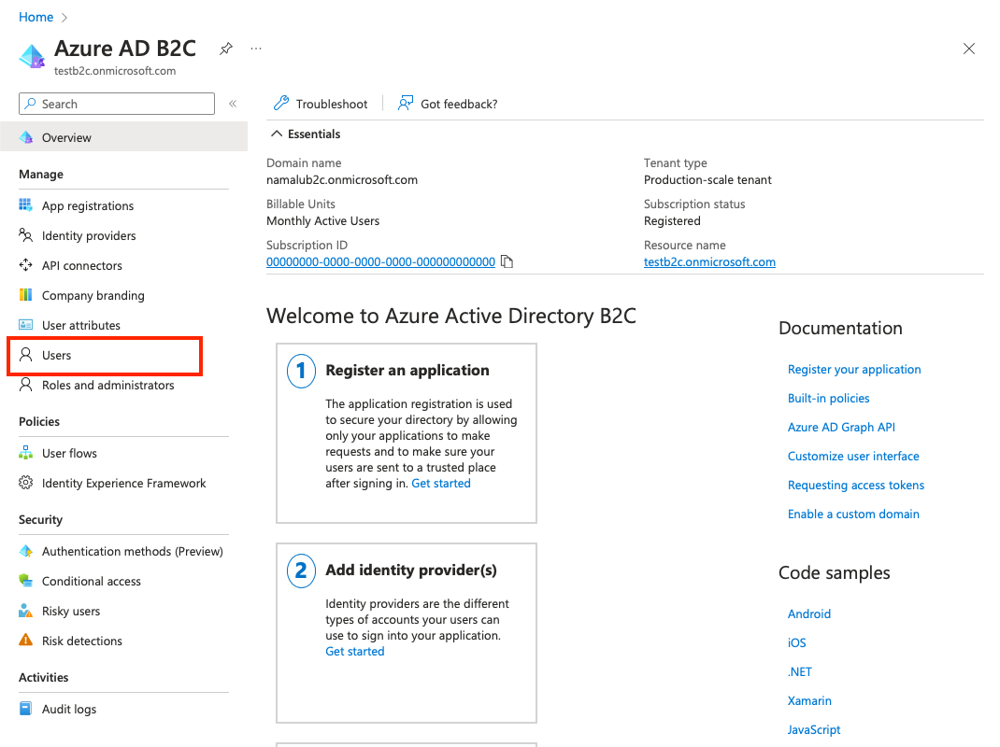

# Validate Azure AD B2C users are able to access FHIR resources

The validation process involves creating a patient resource in the FHIR service, linking the patient resource to the Azure AD B2C user, and configuring Postman to get an access token for B2C users. After the validation process is complete, you can fetch the patient resource by using the B2C test user.

## Overview

This tutorial provides instructions on how to validate your FHIR service and B2C Tenant is configured properly.

1. [Run Postman to get an access token](#run-postman-to-get-an-access-token)
1. [Create a Patient Resource in the FHIR service](#create-a-patient-resource-in-the-fhir-service)
1. [Link the Patient Resource to the Azure B2C user](#link-the-patient-resource-to-the-azure-b2c-user)
1. [Configure Postman to obtain an access token for B2C users](#configure-postman-to-obtain-an-access-token-for-b2c-users)
1. [Fetch the Patient Resource using the B2C user](#fetch-the-patient-resource-using-the-b2c-user)

## Prerequisites

* An Azure Active Directory B2C Tenant configured as outlined in [this](/azure-b2c-setup.md) document.
* An Azure Health Data Services FHIR Service has been deployed as outlined in [this](/deploy-fhir-service.md) document.

## Run Postman to get an access token

Run the [Postman](https://www.postman.com) application locally or in a web browser. For steps to obtain the proper access to the FHIR service, see [Access the FHIR service using Postman](https://learn.microsoft.com/en-us/azure/healthcare-apis/fhir/use-postman).

When you follow the steps to [GET FHIR resource](https://learn.microsoft.com/en-us/azure/healthcare-apis/fhir/use-postman#get-fhir-resource) section, the request returns an empty response because the FHIR service is new and doesn't have any patient resources.

## Create a Patient Resource in the FHIR service

It's important to note that users in the B2C tenant aren't able to read any resources until the user is linked to a FHIR resource, for example as patient or practitioner. A user with the `FhirDataWriter` or `FhirDataContributor` role in the Microsoft Entra ID where the FHIR service is tenanted must perform this step.

1. Create a Patient with a specific identifier by changing the method to `PUT` and executing a request to `{{fhirurl}}/Patient/1` with the following body:

```json
{
    "resourceType": "Patient",
    "id": "1",
    "name": [
        {
            "family": "Patient1",
            "given": [
                "Test"
            ]
        }
    ]
}
```

2. Verify the patient is created by changing the method back to `GET` and verifying that a request to `{{fhirurl}}/Patient` returns the newly created patient.

## Link the Patient Resource to the Azure AD B2C user

In the [azure-b2c-setup.md](/azure-b2c-setup.md#add-a-test-user-to-b2c) a user was created named "Test Patient1", and the FHIR service now contains a Patient resource that represents "Test Patient1". 
You need to create an explicit link between the test user in the B2C tenant and the resource in the FHIR service. 

1. Go to the B2C tenant. On the left pane, choose "App registrations".

2. Select "All applications".

3. Select the application with the prefix "b2c-extensions-app".


4. Note the Application (client) ID value. 


5. Navigate back to the B2C tenant home page, on the left pane select "Users".



6. Select the test user that was created in the [azure-b2c-setup.md](/azure-b2c-setup.md#add-a-test-user-to-b2c).


7. Note the "Object ID" value.


8. Run below command to login with a user that has the Global Administrator role for the B2C Tenant to the created AZURE AD B2C tenant(It is a good idea to create a new Admin user in the B2C tenant to manage users in the tenant.).

Azure CLI
```bash
az login --tenant "<YOUR_B2C_TENANT_NAME>.onmicrosoft.com" --allow-no-subscriptions
```

Powershell:
```Powershell
Connect-AzAccount -tenant "<YOUR_B2C_TENANT_NAME>.onmicrosoft.com" 
```

9. Run the below command to link the user in the B2C tenant to the patient resource in the FHIR service.

Windows:
```Powershell
    powershell ./scripts/UserAttributeMapping.ps1 -b2cExtensionsAppId "<B2C_EXTENSION_APP_ID_NO_HYPHENS>" -UserObjectId "<USER_OBJECT_ID>" -FhirUserValue "<https://{YOUR_FHIR_SERVICE}.azurehealthcareapis.com/Patient/1>"
```

 Mac/Linux:
```bash
    pwsh ./scripts/UserAttributeMapping.ps1 -b2cExtensionsAppId "<B2C_EXTENSION_APP_ID_NO_HYPHENS>" -UserObjectId "<USER_OBJECT_ID>" -FhirUserValue "<https://{YOUR_FHIR_SERVICE}.azurehealthcareapis.com/Patient/1>"
```

## Configure Postman to obtain an access token for B2C users

Obtain an access token to test the authentication flow.

1. Launch the Postman application and create a new "Blank collection". Optionally, you can name the collection. In this example the collection was named "FHIR Patient".


2. Select the "Authorization" tab in the collection overview.

3. In the "Type" dropdown, select "OAuth 2.0".


4. Scroll down to the "Configure New Token" section and enter these values:

### Callback URL

This value was configured when the B2C Resource application is created [azure-b2c-setup.md](/azure-b2c-setup.md#create-a-new-b2c-resource-application)

```text
https://oauth.pstmn.io/v1/callback
```

### Auth URL

This value can be created using the name of the B2C Tenant and the name of the [user flow](/azure-b2c-setup.md#create-a-new-b2c-user-flow).

```text
https://{YOUR_B2C_TENANT_NAME}.b2clogin.com/{YOUR_B2C_TENANT_NAME}.onmicrosoft.com/{YOUR_USER_FLOW_NAME}/oauth2/v2.0/authorize
```

### Access Token URL

This value can be created using the name of the B2C Tenant and the name of the [user flow](/azure-b2c-setup.md#create-a-new-b2c-user-flow).

```text
https://{YOUR_B2C_TENANT_NAME}.b2clogin.com/{YOUR_B2C_TENANT_NAME}.onmicrosoft.com/{YOUR_USER_FLOW_NAME}/oauth2/v2.0/token
```

### Client Id

This value is the Application (client) Id of the [B2C resource application](/azure-b2c-setup.md#create-a-new-b2c-resource-application).

```text
{YOUR_APPLICATION_ID}
```

### Scope

This value is defined in the B2C resource application in the "Expose an API" section. in the [example](/azure-b2c-setup.md#create-a-new-b2c-resource-application). The scope granted permission is `patient.all.read`. The scope request must be a fully qualified URL.
for example, `https://testb2c.onmicrosoft.com/fhir/patient.all.read`.

5. Copy the fully qualified scope from the "Expose an API" section of the B2C resource application.

```text
{YOUR_APPLICATION_ID_URI}/patient.all.all
```


Once all the values have been added click "Save".

## Fetch the Patient Resource using the B2C user

Verify that Azure AD B2C users can access FHIR resources.

1. When the Authorization configuration in Postman is setup to launch the B2C user flow, choose "Get New Access Token" to get an access token.


2. Use the "Test Patient" credentials to sign in.


3. Choose "Use Token" to use the access token for any requests in the collection.


4. Create a new request to search for Patient resources in the FHIR service. Select the ellipsis button (...) next to the name of the collection and then choose "Add request".


5. Set the method to `GET`, enter the fully qualified FHIR service URL and add the path `/Patient`.

6. Choose "Send".

7. Verify that the response contains the single Patient resource. 


